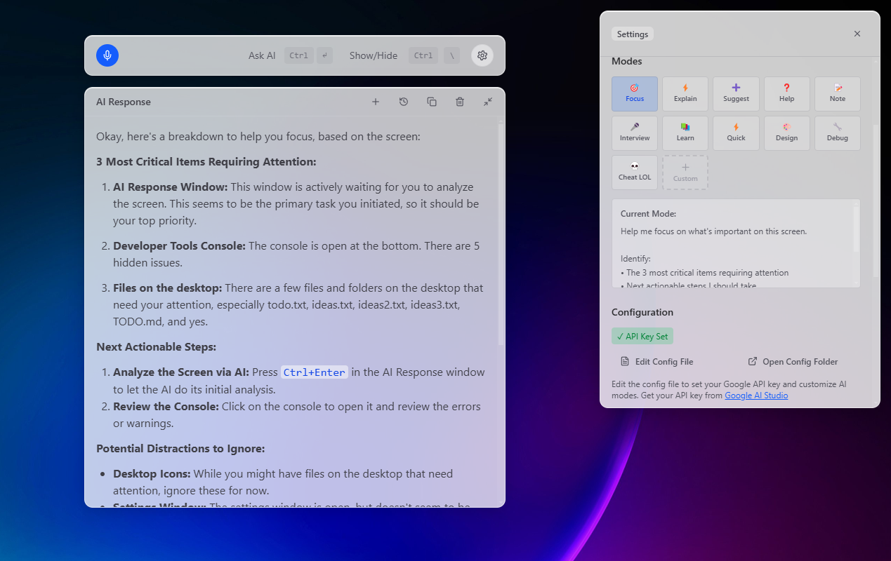

# Clue

Clue is a cool overlay to make life easier.



- Not detectable by Zoom, Meet, Teams.
- JSON Config:
  ```json
  {
    "aiModel": "gemini-2.0-flash",
    "apiKey": "",
    "theme": "dark",
    "opacity": 100,
    "selectedModeId": "focus",
    "modes": [
      {
        "id": "focus",
        "name": "Focus",
        "icon": "🧘",
        "prompt": "Help me focus on what's important on this screen...",
        "category": "productivity",
        "isCustom": true
      },
      {
        "id": "explain",
        "name": "Explain",
        "icon": "⚡",
        "prompt": "Explain what I'm looking at in simple terms...",
        "category": "help",
        "isCustom": true
      }, ... // add custom modes
    ]
  }
  ```
- Move panel around screen using `Ctrl or ⌘ + ↑ ↓ ← →`
- Uses shortcuts to interact:
  - `Ctrl or ⌘ + \` Show/Hide
  - `Ctrl or ⌘ + ↵` Send
  - `Ctrl or ⌘ + M` Start listening
- Settings panel to customize theme, modes, AI model, panel opacity and open config file.

### Install

TODO: add builds for user convenience.

```bash
bun install
```

### Development

```bash
bun dev
```

### Build

```bash
# For windows
bun build:win

# For macOS
bun build:mac

# For Linux
bun build:linux
```
